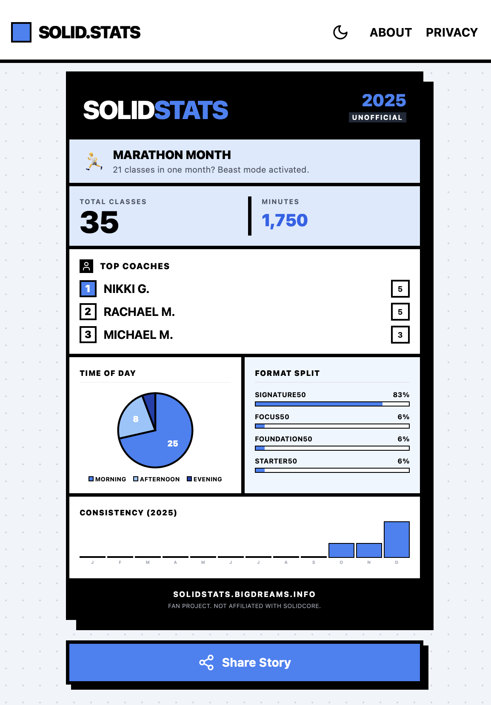

# SolidStats

An unofficial year-in-review stats generator for Solidcore workouts. Upload your Mindbody schedule export and get a shareable "Wrapped" style summary of your classes.



## Features

- Client-side PDF parsing (no data uploaded to servers)
- Workout statistics: total classes, minutes, top coaches, longest streak
- Time-of-day breakdown and class format distribution
- Monthly consistency graph
- Personality titles based on workout patterns
- Shareable stats card image export (9:16 for stories)
- Multi-year support with year selector
- Dark mode support

## Getting Started

### Prerequisites

- Node.js 18+
- npm

### Installation

```bash
npm install
```

### Development

```bash
npm run dev
```

Open http://localhost:5173 in your browser.

### Build

```bash
npm run build
```

Output is in the `dist/` directory.

## How to Use

1. Log in to [Mindbody](https://www.mindbodyonline.com/explore/account/schedule) on desktop
2. Go to Schedule > Completed
3. Click "View More" until all your classes are loaded
4. Right-click > Print > Save as PDF
5. Upload the PDF to SolidStats

## Tech Stack

- React 18 + TypeScript
- Vite
- Tailwind CSS
- pdfjs-dist (PDF parsing)
- modern-screenshot (image export)

## Privacy

All processing happens in your browser. Your PDF is never uploaded to any server. Data is cleared when you close the tab.

## Disclaimer

This is an unofficial fan project. It is not affiliated with, endorsed by, or connected to Solidcore or Mindbody in any way.

## License

MIT License

Copyright (c) 2025

Permission is hereby granted, free of charge, to any person obtaining a copy
of this software and associated documentation files (the "Software"), to deal
in the Software without restriction, including without limitation the rights
to use, copy, modify, merge, publish, distribute, sublicense, and/or sell
copies of the Software, and to permit persons to whom the Software is
furnished to do so, subject to the following conditions:

The above copyright notice and this permission notice shall be included in all
copies or substantial portions of the Software.

THE SOFTWARE IS PROVIDED "AS IS", WITHOUT WARRANTY OF ANY KIND, EXPRESS OR
IMPLIED, INCLUDING BUT NOT LIMITED TO THE WARRANTIES OF MERCHANTABILITY,
FITNESS FOR A PARTICULAR PURPOSE AND NONINFRINGEMENT. IN NO EVENT SHALL THE
AUTHORS OR COPYRIGHT HOLDERS BE LIABLE FOR ANY CLAIM, DAMAGES OR OTHER
LIABILITY, WHETHER IN AN ACTION OF CONTRACT, TORT OR OTHERWISE, ARISING FROM,
OUT OF OR IN CONNECTION WITH THE SOFTWARE OR THE USE OR OTHER DEALINGS IN THE
SOFTWARE.
